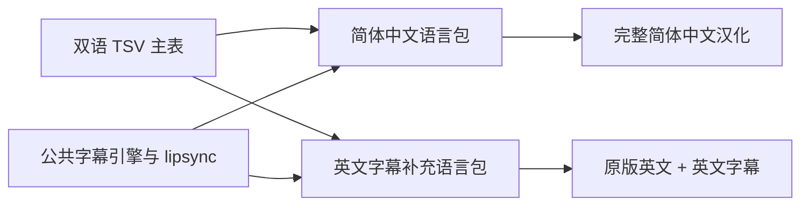

# 英文字幕独立模式设计

## 目标

英文模式只为原版英文游戏补充字幕，继续使用原版英文菜单、HUD、面板和字体。它与完整简体中文汉化并列为安装器中的独立选项，不共享语言覆盖文件。

## 现有基础

`src/translations` 中的对白、无线电和 AI 语音表已经同时保存 `en` 与 `zh` 列。英文字幕可直接从 `en` 列生成，无需再次抄录台词：

- `dialogue_lips.tsv`
- `radio_chatter.tsv`
- `ai_vo_gap.tsv`

现有 lipsync decl、声音挂钩、距离/PVS 可听性门控和字幕队列都可以复用。

## 资源边界

英文模式仅部署以下新增内容：

- 公共字幕版 `q4game.dll`。
- 字幕 GUI 与 lipsync decl。
- 从 TSV `en` 列生成的 `english_lips.lang`。
- 语音路径别名包。

中文字体、中文菜单、中文 HUD 和 Strogg 中文转译资源不进入英文模式。

## 安装器交互

安装器增加两个互斥模式：

1. `完整简体中文汉化`
2. `英文原版 + 英文字幕`

界面语言切换只改变安装器自身显示语言，不改变所选游戏模式。游戏模式由独立选项决定，避免把“安装器显示英文”误解为“安装英文字幕”。

英文模式创建独立启动器和存档目录，避免旧存档序列化的 GUI 状态覆盖另一语言模式。英文启动参数使用 `sys_lang english`，并保留原版字体设置。

## 引擎最小改动

字幕系统需要把以下中文专用表现改为按 `sys_lang` 选择：

- 中文模式使用全角冒号，英文模式使用半角冒号和空格。
- 无名友军回退名分别使用“士兵”和 `Marine`。
- 中文模式读取中文 fontdat 做断行度量；英文模式读取原版字体 fontdat。

字幕触发、可听性判断、时长、队列和字幕面板行为保持一致。

## 验收

- 英文模式菜单、HUD、任务面板和场景 GUI 与原版一致。
- 英文对白、无线电、PA 和 AI 语音均有字幕。
- 英文模式分发包不包含中文字体和中文 GUI 覆盖。
- 两种模式分别从新流程进入并完成换图、读档和字幕测试。
