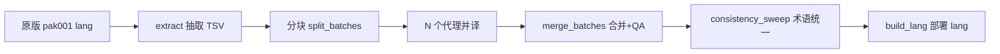

# idTech4 家族中文汉化制作流程指南

> 面向想给 idTech4 家族游戏（Doom 3、Quake 4、Prey 2006、Enemy Territory: Quake Wars）做中文汉化的开发者。本指南把本项目 Quake 4 汉化的完整踩坑与方案沉淀成一份可复用的方法论，避免重新摸索。

---

## 目录

1. [引擎与工具选型](#1-引擎与工具选型)
2. [中文渲染开启](#2-中文渲染开启)
3. [翻译工程组织](#3-翻译工程组织)
4. [字体导出（自研 exporter）](#4-字体导出自研-exporter)
5. [字符集设计](#5-字符集设计)
6. [字幕系统实装](#6-字幕系统实装)
7. [语音资产映射](#7-语音资产映射)
8. [存档兼容性](#8-存档兼容性)
9. [字体基线与拉伸修复](#9-字体基线与拉伸修复)
10. [Strogg 外星文语义](#10-strogg-外星文语义)
11. [自动化测试](#11-自动化测试)
12. [分发与版权](#12-分发与版权)

---

## 1. 引擎与工具选型

### 引擎选 idTech4A++（GPL），不选原版 Quake4.exe

原版引擎的问题：
- 无中文/宽字库路径（`sys_lang` 无 `chinese` 分支）
- 无字幕系统
- 无头会话卡 intro 视频（无法自动化对照）

选 [idTech4A++（`com.n0n3m4.diii4a`）](https://github.com/glKarin/com.n0n3m4.diii4a) 的理由：
- 已实现 `harm_gui_wideCharLang` 宽字库路径（UTF-8 语言文件）
- 已实现 `com_skipLevelLoadPause 1` 跳 CLICK TO CONTINUE
- 提供 `exportFont` 控制台命令导出 fontdat + TGA 图集
- 可在 Windows/Linux/Android 编译，方便自动化测试
- **必须用 `v1.1.0harmattan70` tag**，`master` 编译的 DLL 与 h70 引擎 ABI 不兼容（进图即崩）；h70 时源码路径在 `Q3E/src/main/jni/doom3/neo` 而非顶层 `doom3/neo`

### 启动参数最佳实践（零污染）

```bat
Quake4.exe ^
 +set fs_basepath "%GAME_DIR%" ^
 +set fs_savepath "%~dp0savedata" ^
 +set sys_lang chinese ^
 +set harm_gui_wideCharLang 1
```

- `fs_basepath` = 玩家原版游戏目录（引擎从这里读取原版 pk4）
- `fs_savepath` = 汉化包目录下的 `savedata`（引擎在这里写配置/存档、加载覆盖资产）
- 结果：玩家原版目录**只读**，汉化 100% 隔离

---

## 2. 中文渲染开启

### lang 文件

Raven 分五个 lang 文件（原版是英文，我们要生成对应的中文）：

| 文件 | 用途 | 条目量级 |
|---|---|---|
| `chinese_code.lang` | 引擎硬编码文本（UI、菜单、错误提示） | 695 |
| `chinese_guis.lang` | GUI 文件里 `#str_` 引用 | 1098 |
| `chinese_maps.lang` | 关卡内 objective/hint | 476 |
| `chinese_mappack.lang` | 关卡 pack 元数据 | 3 |
| `chinese_lips.lang` | 剧情对白（配 lipsync decl） | 3962 |

### 关键要点

1. **必须 UTF-8 with BOM**：无 BOM 会按 GBK 解析报错
2. **松散放置生效**：`savedata\q4base\strings\chinese_*.lang` 直接加载，不必打 pk4
3. **必须五个全生成**：引擎跨 pk4 按条目合并同名 lang，中文无底包必须自己合并全量
4. **`#str_` 别名不通用**：`#str_00098` 与 `#str_98` 不等价，抄原版键名不要补零
5. **cvar 顺序敏感**：`sys_lang` 必须在 `harm_gui_wideCharLang` 之前设置

---

## 3. 翻译工程组织

### TSV 主表

用 TSV（Tab-Separated Values）而不是 lang 直接编辑：

```
key           en                          zh                          note
#str_100001   Load Game                   加载游戏
#str_200474   NEUROCYTE                   神经细胞
#str_301220   ...this way, ...            ...往这边走，...            上下文：Voss 引导登船
```

优点：
- 可 grep/sed/diff/git blame
- 可并行分块交给多个翻译代理
- QA 复核用 note 列标记存疑（`qa_doubts.txt`）

### 翻译流水线



### 术语一致性

- 建 `docs/glossary.md` 术语表：专名保留英文/军衔全译/武器名全译/小队名全译
- `consistency_sweep.py` 扫描全表检查术语一致（如 squib → 杂碎、Berserker → 狂战士）
- **人名/舰船先审性别**：`He's the only one...` 决定 Rhodes 男性；早期简报可能误标，QA 复核所有台词性别用语

### 中西文混排空格（v1.0 规范）

术语表第 7 条：**中英文之间保留半角空格**（"MCC 着陆场" vs "MCC着陆场"）。这是排版规范，不是残留 bug。

---

## 4. 字体导出（自研 exporter）

### 引擎自带 `exportFont` 的三个缺陷

1. **48 号 fontdat 度量坏**（引擎 bug）——需用 24 号复制为 48 号绕过
2. **字符集最后一个字符丢失**——尾部垫哨兵字符（如 `￥`）绕过
3. **字距忽宽忽窄**：
   - FT 紧贴位图丢弃左侧 bearing
   - 引擎 `PaintChar` 从不读 `pitch/bearing`，字形笔画全左贴字元格 → 空白堆右侧
   - 位图宽度按 4 像素对齐量化 → 空隙台阶跳变
   - `xSkip = advance + 1` 手加字距 → 整体偏松

**结果**：菜单/字幕出现"目 标"式伪空格。

### 自研 exporter 的关键技术点

写 `export_font.py`（Pillow + fontTools），关键：

1. **bearing 烘进位图**：位图含左侧留白列，宽 = bearing + ink，绘制端保持默认（左贴）即可
2. **xSkip 用真实 advance**（四舍五入），不手加 1
3. **基础段与宽表同字体**：引擎硬编码基础段（0-255）单页 `fonts/<lang>/<家族>_<字号>.tga`，用同 TTF 自渲染（曾试拼接原版英文段，小型大写风格与雅黑/思源参差不齐，否决）
4. **2x 超采样**：按名义字号 2 倍分辨率渲染进贴图，度量按名义字号写整数；引擎双线性缩小采样完成 AA；解决"源分辨率<屏显尺寸放大出锯齿"（HUD/名牌/字幕全档受益）
5. **宽表只收 charcode >= 256**：引擎 `GLYPH_END=255` 以下永远走基础段
6. **真 48 号**：引擎按槽位取 `glyphScale = pointSize / requestSize`；旧"48=24 复制"实际让大字号文本减半，必须修正
7. **标点修形**：
   - U+2014 破折号横向拉伸至满格宽（两个连排不断线）
   - U+2014 / U+2026 垂直居中到 CJK 视觉中线（雅黑/思源原生贴底线，中文排版难看）
8. **fontdat 布局**（Raven 分支 `tr_font.cpp` `R_Font_ParseWideFont`）：
   ```
   基础段 256 × 9 float(imageWidth, imageHeight, xSkip, pitch, top, s, t, s2, t2)
   + 5 float 头(pointSize, maxWidth, maxHeight, delta, 0)
   + 宽表 magic u32(0x69647466) version u32(0x00010001) numFiles i32 width i32 height i32
     numIndexes i32, indexes[n] i32, numGlyphs i32,
     每字形 9 float + shaderName char[32]
   ```
9. **TGA 32 位 BGRA + RLE (type 10)**：引擎 `LoadTGA` 支持 RLE + 描述子 0x20 顶向下；逐行等值区段全编 RLE，缩 5-10 倍
10. **同源家族共享贴图**：多个 UI 家族用同一 TTF 时，只渲染一套贴图；其余家族 fontdat 字节复制本尊（宽表 `shaderName` 只存"1_24.tga"后缀，家族前缀由引擎运行时用 `fontName` 拼），加 `.mtr` 材质别名显式 decl `map` 指向本尊贴图。**结果**：Quake 4 六套字体家族共享一套贴图，磁盘从 1067MB → 131MB

### 字体选型经验

- **微软雅黑粗体**（`msyhbd.ttc`）12 号单色下笔画粘连锯齿重，否决
- **微软雅黑常规**（`msyh.ttc`）r4 基线，但**位图字体再分发有版权风险**（微软版权）
- **思源黑体 Medium**（Adobe/Google，OFL 开源）**定案**：字幕小字厚实清晰、可随补丁分发

---

## 5. 字符集设计

### 三个字符集档位

| 档位 | 用途 | 字形量 |
|---|---|---|
| `min` | 试验用最小集（首/末 100 字） | ~100 |
| `full` | GB2312 全区 ∪ 翻译主表实用字 ∪ ASCII | ~7500 |
| `ui` | 主表实用字（对白不会渲染 48 号大字） | ~1140 |

### 生成公式

```python
gb2312 = { c for hi in range(0xA1,0xF8) for lo in range(0xA1,0xFF)
           if (c := bytes((hi,lo)).decode("gb2312", "ignore")) and ord(c) >= 256 }
used = { c for tsv in translation_tsvs for row in tsv for c in row.zh }
full  = gb2312 | used | full_width_punct     # 12/24 号用
ui    = used  | full_width_punct              # 48 号大字用（省显存）
```

### 全角标点保底

即使不在 GB2312/主表实用字里，也要保留全角标点（中文排版必需）：

```python
PUNCT = set("，。！？、；：……——""''（）《》【】·￥")
```

### 常见坑

- **翻译期发现的新字**：`export_font.py` 从 TSV 主表现拉字符集，无需手动维护列表；补翻译后重跑即可
- **子集 TTF 缺字**：引擎回退 `?`；`export_font.py` 用 `fontTools TTFont.getBestCmap()` 检查 cmap，缺字直接跳过而不写空占位

---

## 6. 字幕系统实装

### 挂钩点

Quake 4 原版无字幕系统。三个挂钩点覆盖全部台词场景：

| 场景 | 挂钩函数 | 说明 |
|---|---|---|
| NPC 有嘴模型对白 | `idAI::Speak` → `idAFAttachment::StartLipSyncing` | `speechDecl` 即 lipsync decl 名 |
| 无线电通讯 | `idFuncRadioChatter::Event_Activate` | 挂 `FindLipSync(snd_radiochatter 值, false)` |
| 环境声/PA/无头模型 | `idSound::DoSound(play)` | 按 sound shader 名查 decl（先原名再 `lipsync_` 前缀） |

### 可听性门控

```cpp
bool rvSubtitles::IsAudible(const idEntity* ent, ...) {
    // 过场/全局声/IsVO_ForPlayer/玩家自己 → 一律显示
    if (isCinematic || isGlobal || isPlayerVO) return true;
    // 友军放宽：不做 PVS 门控，距离容差 1.5×
    // 敌军保留 PVS 门控 + 1.15× 容差
    float tolerance = isFriendly ? 1.5f : 1.15f;
    if (dist > shader->maxDistance * tolerance) return false;
    if (!isFriendly && pvsCheck && dist > 240 && !inPlayerPVS(ent))
        return false;
    return true;
}
```

- **_RAVEN 分支声音距离直接是游戏单位**（不转米，见 `sound.h` `//#if !defined(_RAVEN)` 注释）
- cvar `harm_g_subtitleDebug` 打 `[SUB]` 决策日志，验收必开
- **友军 = 同 team 的 `idActor`**：Kovitch/Morris 缺字幕的根因就是脚本让队友远处/隔墙发言被误拦

### 字幕来源前缀

按来源加中文前缀标注：

- 无线电 → `[无线电]`
- speaker → `[广播]`
- 无名友军 AI → `[士兵]`
- 具名 NPC → `[Kane]`、`[Voss]` 等

**MSVC 源文件里中文字面量必须 UTF-8 转义**（如 `"\xE6\x9C\xAA\xE5\x91\xBD\xE5\x90\x8D"`）——窄字符字面量按系统码页（GBK）编进二进制，与 UTF-8 运行时数据比较永远不等。

### 断行（按字体度量）

DLL 启动时经 `fileSystem` 解析 `fonts/chinese/lowpixel_12.fontdat`（结构见 `parse_fontdat.py`：基础段 256×9 float + 5 float 头 + 宽表头 20B + numIndexes + indexes + numGlyphs + 68B/字形，xSkip 在 `float[2]`），逐字符累计 `xSkip × useScale`（0.19 × 48/12 = 0.76），行预算 SUB_TEXT_W = 356 px（gui 文本区 448 留禁则余量）。实测 CJK xSkip=13 → 9.88 px/字 → 43 字/行。

### 断行贪心 bug

空格断点只在行预算 70% 之后才可取（中西文混排中"瘫痪了 Strogg 的"前部空格曾把整行断到 30%）；溢出点落在英文单词中间时才允许回退任意空格防断词。

### AI 台词 decl 缺口（`aiSpeak`）

Kovitch 等 NPC 台词 `aiSpeak` 引用的 decl 原版有大量缺失（引擎默认 decl 播声无文本无口型，"听得到嘴不动没字幕"）。全游戏审计法：

```
gap = { keys from map/def "lipsync_*" }  -  { all .lipsync decl names }
```

审计出 1436 条缺口，其中有 sndshd `description` 文本的 726 条 → 补齐 668 条（**纯音效指示如 `(pain grunt)`、`laugh` 已过滤不出字幕防刷屏**）。

### 无线电字幕 decl 缺口

全游戏 336 条 `func_radiochatter` 台词，原版仅 84 条有 lipsync decl。252 条中 251 条已补齐；剩 `vo_1_2_20_50_1` 全资产无定义 = 死引用，跳过。

- **英文文本一手来源** = `.sndshd` 的 `description` 字段（3948 条 VO shader 全带台词全文，块头格式 `sound <名> {`）
- **辅助源** = Quake4[CC] 听障模组转写（原站已死，用 archive.org 快照 `web/20120209143213/http://gamescc.rbkdesign.com/mods/q4cc_v1.3.zip`）

---

## 7. 语音资产映射

### 引擎 `sys_lang` 路径映射

引擎按 `sys_lang` 把 `sound/vo/` 映射到 `sound/vo_<语言>/`：
- 英文模式 → `sound/vo_english/`
- 中文模式 → `sound/vo_chinese/`

原版 pak001 里只有 `sound/vo_english/*`，中文模式找 `vo_chinese` 落空即静音。

### 解法：语音路径别名 pk4

生成 `zzz_vo_chinese_alias.pk4`，把 pak001 里 `sound/vo_english/*` 全部改路径为 `sound/vo_chinese/*`（英文原声），放 `savedata\q4base\`。**不复制音频到别处**，只在 zip 内改路径（`ZipInfo` 重命名 + 保留原压缩数据）。3406 个音频，64.7MB。

### 分发注意

`zzz_vo_chinese_alias.pk4` 是原版音频的**衍生分发**（版权敏感）——不能随汉化补丁一起发。**必须由玩家运行 postinstall 从自己合法拥有的原版数据现场生成**。

---

## 8. 存档兼容性

### 存档结构与 gui 覆盖

**idTech4 存档按 GUI 源文件结构逐窗口顺序序列化 HUD 状态**（`idWindow::WriteToSaveGame`，无长度前缀，仅 `SyncId` 校验）。

**结构不匹配 → 状态流错位 → 内存踩坏 → 概率性崩在引擎 exe 后续资源加载**（本项目实证：偏移 `0x6af7ed`/`0x30b8c0`，官方 DLL 同样崩）。

### hud.gui 覆盖必须用 pak021 底稿

- **q4base 有多份 hud.gui**（pak001 版 2272 行、pak021 版 2507 行——1.4 补丁最终版），**加载序最高者生效**
- 覆盖必须基于 **pak021 版底稿**（运行时实际生效的那份）
- **覆盖只允许改数值（rect/textscale 等），禁止增删 windowDef/脚本/变量**

### 错配存档表现

- 旧档（原版结构）+ 新覆盖 = 正常加载但 HUD 恢复存档时的旧 rect/旧语言文本（外观回退，换图恢复）
- **用 pak001 版覆盖存的档与现行 pak021 覆盖错配，加载约五成崩且侥幸加载也可能带隐性状态污染，不可信**

### 换图崩溃（GUI 裸指针）

**绝不缓存 GUI 裸指针跨图**——换图时 `uiManager` 释放重建 GUI 实例，缓存指针悬空，下次访问写坏堆 → CRT 快速失败 c0000409。

正确做法：每帧按名 `FindGui`，内部有哈希缓存，开销可忽略。**教训通用于任何游戏 DLL 持有引擎对象指针跨地图**。

---

## 9. 字体基线与拉伸修复

### 拉伸根因

引擎全部 GUI 按 **640×480 虚拟坐标绘制**，`idDeviceContext::AdjustCoords` 把 `x/w` 乘 `屏宽/640`、`y/h` 乘 `屏高/480`（`DeviceContext.cpp`）。1080p 下横向 3.0 vs 纵向 2.25，**多拉 4/3**，方块汉字被拉扁宽（实测屏显比 1.33）。原版英文一直如此，窄拉丁字形不显眼。

### 修复：ASPECT 预压缩

`export_font.py` 里 `ASPECT = (640/480) / (屏宽/屏高) = 0.75`（16:9 下）：
- 字形位图宽度按 `ASPECT` 等比缩放（LANCZOS）
- xSkip 按 `ASPECT` 预乘
- ASCII 同步压缩保证混排节奏

**仅对特定屏比正确**：换非 16:9 屏需按 `(4/3)/(屏宽/屏高)` 改 `ASPECT` 重导。引擎自带 `r_scaleMenusTo43` 只修主菜单且加黑边（HUD/字幕不生效），不采用。

### CJK 视觉基线下沉（drop）

汉字**无降部**且墨迹**顶得高**，在为拉丁字母设计的窗格里普遍偏上（loading 地名/载入中/设置行/切枪武器名等）。

解法：`rasterize` 加 `drop` 参数（12→1、24→2、48→4 名义 px）——**宽表字形位图顶部烘入透明行、`top` 度量不变** → 墨迹相对基线整体下沉、`maxHeight` 与混排不受影响。ASCII 不动（HUD 数字无裁切风险）。

（这是 r3 "不能压 top" 教训的正解：直接改 fontdat top 会破坏中英混排基线；改**位图顶部烘透明行**保持度量不变才对。）

### HUD 数字裁切根源

- 引擎运行时 `maxHeight = max(全部字形 top)`（宽字库 `height := top`，`tr_font.cpp:410`）
- 中文全字库 `maxHeight` 比英文大（chain24: 28 vs 21）→ 所有文本相对英文原版下移、紧 rect 底部被裁
- **不能靠改 fontdat 修**（压 top 会破坏中英混排基线），只能松散覆盖 gui 调 rect
- 自研 exporter 让新字库 `maxHeight` 与英文原版差 ≤1 → **HUD 数字裁切根源消失**，`patch_hud.py` 仅剩无线电两行修正

---

## 10. Strogg 外星文语义

Quake 4 有**两套 Strogg 字体**语义区分：

| 家族 | 语义 | 载体 |
|---|---|---|
| `strogg` | 装饰性外星文（医疗站数字、乱码序号，不承载翻译） | 原版直通 + CJK 稳定映射到符号 |
| `r_strogg` | 神经细胞植入后的可读文（`#str_*` 引用，中文承载） | 思源黑体 Medium |

### 神经细胞转译动画（`med1_textchange.gui`）

Kane 改造苏醒后监视器上"neurocyte implanted"的转译动画：18+7+7 个单字符 `windowDef`，每格两层（`fonts/strogg` 外星层 + `fonts/r_strogg` 可读层），`onNamedEvent changeover` 触发 `resettime "anim" 0` 启动 anim 时间线，每 200 ms 一批乱序对各字母做 `forecolor_w` 交叉淡变（250 ms）+ `bluradd` 泛光（500 ms）+ `guisound_beep2`。

**中文化**：只改 text/rect 数值不动结构 = 存档安全。18 字母改「神经细胞」+「已植入」，subject 面板 3 字改「实验体」，其余置空。

### 装饰 + 可读混用同一 `#str` 的经典难题

24/27 个 `#str_*` 是外星装饰窗 + 可读窗混用同一条译文——如果两个窗口指向同一 `#str` 但字体不同（strogg vs r_strogg），中文文本经 strogg 家族渲染会尝试查 CJK 字形，落空 → `?`。

**解法**：`strogg` 家族=**原版直通** + **合成宽表** 把全量 CJK 按 Knuth 乘散列（`cp * 2654435761 % pool_size`）**稳定伪随机映射**到原版 62 个字母/数字符号字形（`shaderName="<字号>.tga"` 指回 base 单页贴图）。中文文本经此字体自动"外星化"，同一条中文串在装饰窗显示为固定的外星符号串（每次同一映射避免闪烁）。

---

## 11. 自动化测试

### `keybd_event` 无效，用 cfg 帧驱动

- `keybd_event` 合成按键对 SDL 无效（按扫描码解键），`bind` 驱动也不可靠
- 改用**纯 cfg 帧等待驱动**：`wait N` 帧 + `trigger/screenshot/quit` 顺序编排

### cfg 语法坑

```
set harm_g_subtitleDebug 1        ; 数字值 OK
set harm_lang "chinese"            ; 中文值必须加引号，否则静默失效
loadGame checkPoint                ; 存档主键
wait 60                            ; 60 帧 = 1 秒（60 fps）
trigger $objectiveMedic            ; loadGame 后可直接用
screenshot shot00001.tga           ; TGA 输出到 savepath\screenshots\
quit                                ; 结束会话
```

### 判定崩溃

- `savedata\q4base\qconsole.log` 尾部有崩前日志
- Windows 事件查看器 → 应用程序 → Id=1000 有 Faulting 模块 + 偏移
- 批测临时 `HKLM WER DontShowUI=1`（测完还原）避免弹窗打断

### 无 cdb 的 minidump 排障

1. WER LocalDumps DumpType=1 抓 minidump
2. DLL 编译加 `/Zi`、链接加 `/DEBUG /MAP`（CMakeCache.txt 改 `CMAKE_CXX_FLAGS_RELEASE` 与 `CMAKE_SHARED_LINKER_FLAGS_RELEASE` 后**必须 `cmake .` 重新生成**才生效）
3. `pip install minidump`，python 解析：模块表定位段、`thread.ThreadContext` 是 `LOCATION_DESCRIPTOR` 需手解 CONTEXT（Rsp@0x98/Rip@0xF8）、栈内存分页读扫返回地址
4. 用链接器 .map 的 `Rva+Base` 减基址二分映射符号

### `.ps1` / MSVC 源码编码

- `.ps1` 中文注释也必须 **UTF-8 with BOM**（PS 5.1 无 BOM 按 GBK 解析直接炸）
- MSVC 源文件同理（C4819 警告 = 码页误读，必须处理）

---

## 12. 分发与版权

### 不能进汉化补丁的资产（版权敏感物）

| 资产 | 版权归属 | 处理 |
|---|---|---|
| 原版 `q4game.dll`（`q4game.dll.official`） | Raven | 不发；玩家已有 |
| 原版 `strogg_*.{fontdat,tga}`（外星文字体直通） | Raven | 玩家运行 postinstall 从 pak021 现场提取 |
| 原版 `hud.gui`（我们只改 2 处 rect） | Raven | 玩家运行 postinstall 从 pak021 提取 + apply patch |
| 原版 `med1_textchange.gui`（我们只改 35 处 text/rect） | Raven | 玩家运行 postinstall 从 pak001 提取 + apply patch |
| `zzz_vo_chinese_alias.pk4`（英文原声路径别名） | Raven | 玩家运行 postinstall 从 pak001 现场生成 |

### 可以进汉化补丁的资产

- **引擎 `Quake4.exe` + 自研 `q4game.dll`**：派生自 GPL 的 idTech4A++，遵循 GPL 分发（源码必须公开）
- **CJK 字体位图**（思源黑体自渲染 fontdat/tga）：OFL 1.1，可分发
- **翻译文本**（`chinese_*.lang`）：本项目自主翻译，同人非商业性
- **自研 `subtitles.gui`、lipsync decl、材质别名 mtr**：本项目原创
- **Python 工具链、diii4a 引擎补丁**：GPL

### 「一次性 postinstall」模式

设计 `postinstall.cmd` + `build_dist_extras.py` 让玩家首次安装时**从自己合法拥有的原版数据现场生成**版权敏感物，写入 `savedata` 树。既不"分发原版素材"，也不"重复复制音频"（`ZipInfo` 重命名保留原压缩数据）。

---

## 参考

- 引擎源码：[com.n0n3m4.diii4a `v1.1.0harmattan70`](https://github.com/glKarin/com.n0n3m4.diii4a/tree/v1.1.0harmattan70)
- fontdat 结构解析器：`src/tools/parse_fontdat.py`
- Quake4[CC] 无线电转写（archive.org 快照）：`web/20120209143213/http://gamescc.rbkdesign.com/mods/q4cc_v1.3.zip`
